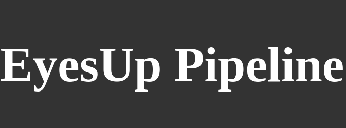

<h1 align="center">
    
</h1>


# :pushpin:  Índice

<p align="center">
    <a href="#sobre-o-projeto">Sobre o projeto</a>&nbsp;&nbsp;&nbsp;|&nbsp;&nbsp;&nbsp;
    <a href="#como-funciona">Como funciona</a>&nbsp;&nbsp;&nbsp;|&nbsp;&nbsp;&nbsp;
    <a href="#tecnologias-utilizadas">Tecnologias utilizadas</a>&nbsp;&nbsp;&nbsp;|&nbsp;&nbsp;&nbsp;
    <a href="#como-rodar-o-projeto">Como rodar o projeto</a>&nbsp;&nbsp;&nbsp;|&nbsp;&nbsp;&nbsp;
    <a href="#licença">Licença</a>&nbsp;&nbsp;&nbsp;|&nbsp;&nbsp;&nbsp;
    <a href="#contato">Contato</a>
</p>


<h1><a id="sobre-o-projeto"> :bulb:  Sobre esta aplicação </a></h1>

Possui como objetivo na implantação de uma pipeline do projeto EyesUP, que por sua vez, consiste em um sistema de monitoramento de aplicações WEB e API's desenvolvido na disciplina de Desenvolvimento WEB do curso de Tecnologia de Redes de Computadores do IFPB - Campus JP. (Mais detalhes sobre o projeto EyesUP podem ser encontrados no <a href="https://github.com/abrantedevops/Project_API_DW.git" target="_blank">aqui</a>)

O foco neste momento é na utilização de ferramentas devops para a implantação do projeto, sendo elas: Vagrant, Ansible, Docker e Docker Compose. Assim, o projeto é executado em uma máquina virtual, criada pelo Vagrantfile, e os softwares necessários para a execução do projeto são instalados e configurados pelo playbook ansible. Por fim, o Docker Compose é utilizado para a configuração e execução dos containers do frontend e backend da aplicação. 


<h1><a id="como-funciona"> :wrench:  Como funciona </a></h1>

A pipeline do projeto é composta por 3 etapas, sendo elas descritas abaixo pelos seus respectivos arquivos:
- `Vagrantfile`: Criação de uma máquina virtual para a implantação do projeto
- `Playbook Ansible`: Instalação e configuração de todos os softwares necessários para a execução do projeto
- `Docker Compose`: Criação de um arquivo de configuração para a execução dos containers


<h1><a id="tecnologias-utilizadas"> :rocket:  Tecnologias DevOps utilizadas</a></h1>

- [Vagrant](https://www.vagrantup.com/)
- [Ansible](https://www.ansible.com/)
- [Docker](https://www.docker.com/)
- [Docker Compose](https://docs.docker.com/compose/)
- [Docker Hub](https://hub.docker.com/)

<h1><a id="pre-requisitos"> :warning:  Pré-requisitos para utilizar com o Vagrantfile</a></h1>

O Vagrantfile utiliza o Provider VirtualBox, portanto é necessário que o mesmo esteja instalado em sua máquina. Caso não tenha, acesse o link abaixo e siga as instruções de instalação:

- [VirtualBox](https://www.virtualbox.org/wiki/Downloads)


<h1><a id="como-rodar-o-projeto"> :computer:  Como rodar o projeto (Utilizando o Vagrantfile (VM))</a></h1>


```bash
# Clone este repositório
$ git clone https://github.com/abrantedevops/EyesUp_Pipeline_sep.git

# Acesse a pasta do projeto no terminal/cmd
$ cd EyesUp_Pipeline_sep

# Execute o comando abaixo e aguarde a finalização de todo o processo
$ vagrant up

# Execute o comando abaixo para acessar a máquina virtual
$ vagrant ssh

# Insira a newtork privada da VM no navegador e tenha acesso a aplicação
http://192.168.57.10


# Para habilitar e acessar a interface gráfica do Prisma (db) da aplicação, faça o seguinte.

# i) Entre na VM com o comando abaixo
$ vagrant ssh

# ii) Ative a interface gráfica do prisma
$ sudo docker exec -it db npx prisma studio

# iii) Acesse a porta 5555. Digite no navegador:
http://192.168.57.10:5555

# Interromper a execução da VM, execute o comando abaixo:
$ vagrant halt
```


<h1><a id="licença"> :pencil:  Licença</a></h1>


MIT License

Copyright (c) 2012-2022 Thiago Abrante de Souza

Permission is hereby granted, free of charge, to any person obtaining
a copy of this software and associated documentation files (the
"Software"), to deal in the Software without restriction, including
without limitation the rights to use, copy, modify, merge, publish,
distribute, sublicense, and/or sell copies of the Software, and to
permit persons to whom the Software is furnished to do so, subject to
the following conditions:

The above copyright notice and this permission notice shall be
included in all copies or substantial portions of the Software.

THE SOFTWARE IS PROVIDED "AS IS", WITHOUT WARRANTY OF ANY KIND,
EXPRESS OR IMPLIED, INCLUDING BUT NOT LIMITED TO THE WARRANTIES OF
MERCHANTABILITY, FITNESS FOR A PARTICULAR PURPOSE AND
NONINFRINGEMENT. IN NO EVENT SHALL THE AUTHORS OR COPYRIGHT HOLDERS BE
LIABLE FOR ANY CLAIM, DAMAGES OR OTHER LIABILITY, WHETHER IN AN ACTION
OF CONTRACT, TORT OR OTHERWISE, ARISING FROM, OUT OF OR IN CONNECTION
WITH THE SOFTWARE OR THE USE OR OTHER DEALINGS IN THE SOFTWARE.

<h1><a id="contato"> :iphone:  Contato</a></h1>

- [Thiago A. Souza](mailto:thiago.abrante@academico.ifpb.edu.br)

